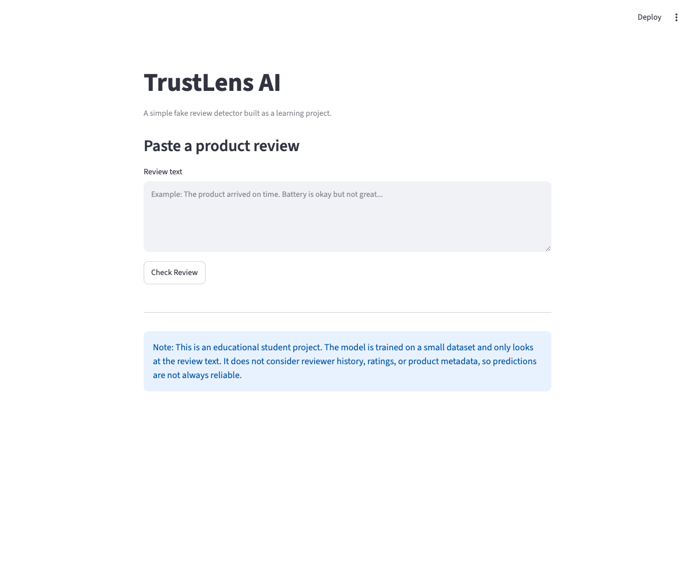
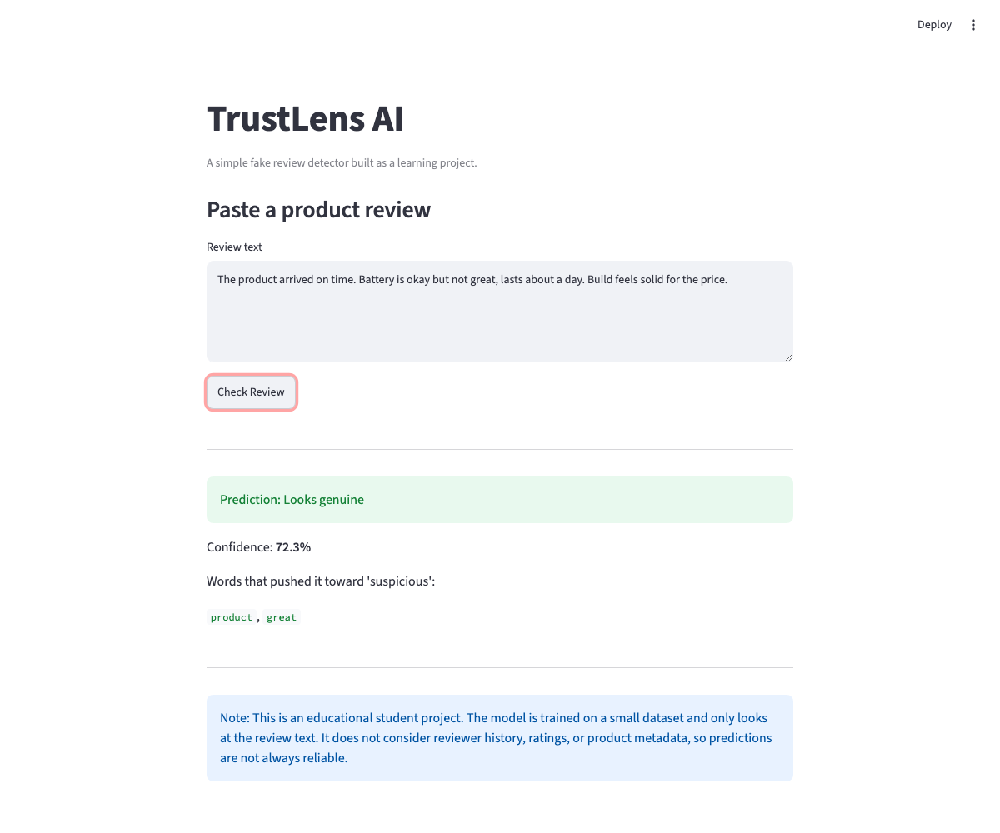
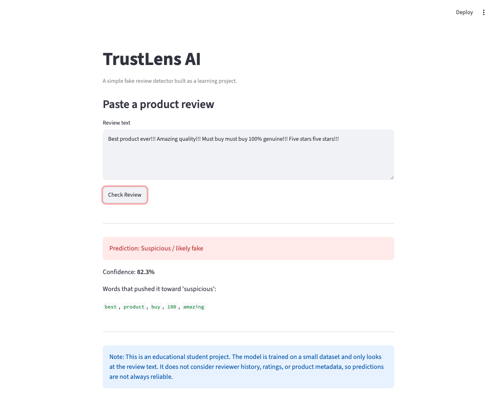

# TrustLens AI – Fake Review Detection

TrustLens AI is a small ML project that tries to guess whether a product review looks genuine or fake. You paste in a review and it predicts genuine vs suspicious, gives a confidence score, and points out the words that made it lean "suspicious." I built it while getting comfortable with basic NLP and scikit-learn.

## Why I built this

I read a lot of reviews before buying anything online, and some of them just feel off — walls of exclamation marks, the same phrases over and over ("best ever", "must buy", "100% genuine"). I wanted to see whether a simple model could pick up on that, and use it as an excuse to practice the whole ML workflow end to end: dataset → train → evaluate → small app. It's a learning project, not a real detector.

## What it does

Paste a review into the app and it shows:
- genuine or suspicious
- a confidence score for the prediction
- the words from your review that pushed it toward "suspicious"

## How it works

1. **Data** — a CSV of reviews labelled `0` (genuine) or `1` (suspicious). I wrote the examples myself, mixing calm, specific reviews with over-the-top promotional ones.
2. **Cleaning** — lowercase, collapse extra spaces, drop stray symbols. Deliberately minimal.
3. **Features** — `TfidfVectorizer` with unigrams *and* bigrams. The bigrams turned out to matter: "must buy" and "best ever" are much stronger signals than those words on their own.
4. **Model** — Logistic Regression with `class_weight="balanced"`. Simple, fast, and its coefficients are readable, which is what I use to surface the suspicious words.
5. **Evaluation** — a stratified 80/20 split with accuracy, precision, recall, and F1.

## The dataset

It's small and handwritten — about 100 reviews, evenly split between genuine and suspicious. The suspicious ones are intentionally exaggerated so the patterns are clear; real fake reviews are subtler and this model would miss a lot of them. I kept the classes balanced so accuracy isn't misleading.

## How I checked it

`train_model.py` prints the four standard metrics on the held-out 20%. In my runs the F1 lands around 0.9, but the test set is only ~20 reviews, so I don't read it as a real score — it bounces between runs and mostly just tells me the model isn't broken. On something this small, whether the suspicious-word explanations look sensible matters more than the number, and those hold up.

## Tech stack

Python, pandas, scikit-learn (TF-IDF + Logistic Regression), Streamlit for the UI, and joblib to save and load the model.

## Running it

```bash
git clone https://github.com/<your-username>/TrustLens-AI.git
cd TrustLens-AI
pip install -r requirements.txt
python train_model.py     # trains and saves models/model.pkl + vectorizer.pkl
streamlit run app.py      # opens http://localhost:8501
```

To isolate it first: `python -m venv venv`, then `source venv/bin/activate` (Windows: `venv\Scripts\activate`). If the model files aren't there yet, the app will tell you to run `train_model.py`.

## Screenshots







## What I picked up

- TF-IDF clicked once I saw it down-weight common words and lift the rare, telling ones — that's why the "genuine"-sounding buzzwords stand out.
- Adding bigrams made a visible difference; the marketing phrases really only show up as word pairs.
- Accuracy on its own can mislead, so precision/recall/F1 are the numbers I actually read — especially for the "suspicious" class.
- Saving the model with joblib let me keep training and the app as separate scripts, which kept things from getting tangled.
- Streamlit got me a usable UI without writing any HTML or CSS.

## Where it falls short

- ~100 handwritten reviews is tiny; a real detector needs thousands of labelled, realistic examples.
- It only reads the review text — no reviewer history, rating patterns, verified-purchase flag, account age, or product info, all of which matter in practice.
- My "suspicious" examples are caricatures, so subtle fakes would slip right past it.
- The highlighted words come from logistic-regression coefficients — a rough hint at the "why," not a guarantee.
- Metrics move with the random split because the test set is so small.

## Things I'd add next

- A larger, real dataset (the Yelp or Amazon review sets).
- Compare other models — Naive Bayes, linear SVM, maybe a small neural net.
- Features beyond text: review length, punctuation density, reviewer history.
- Cross-validation instead of a single split for steadier numbers.
- Deploy on Streamlit Community Cloud so people can try it without cloning.

---

This is a learning project — please don't use it to judge reviews anywhere real. It only knows the patterns in a small handwritten dataset, so it gets plenty wrong.
